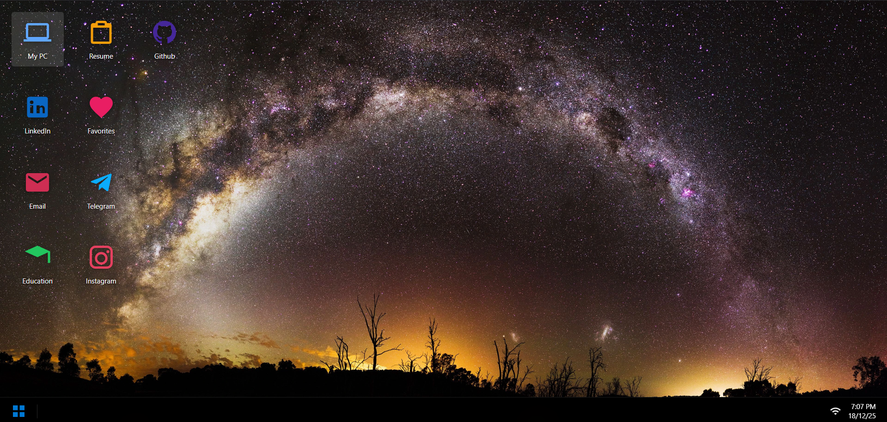
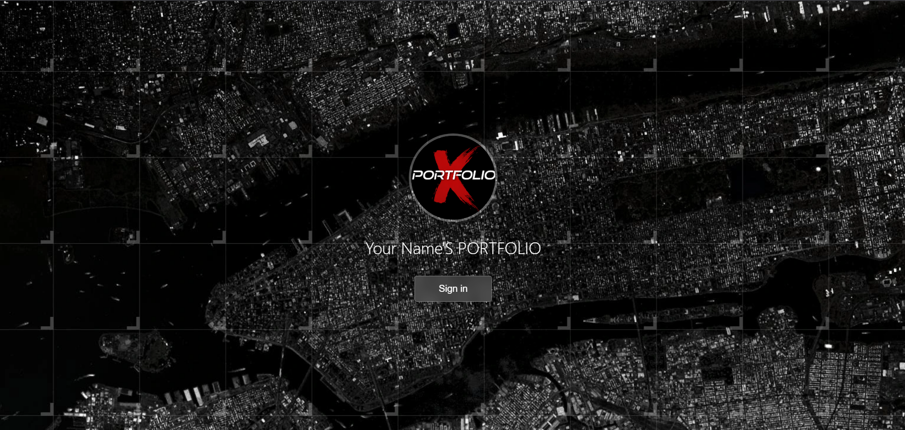

# Portfolio-X Website

A desktop-like interactive portfolio website built using **HTML, CSS, and JavaScript**.  
It looks and behaves like a mini operating system with apps, windows, taskbar, and start menu.

This project is **fully static** and can be hosted on **Netlify, Cloudflare Pages, or GitHub Pages**.

---

## ✨ Features

- Boot screen and login screen  
- Windows-style desktop UI  
- Start menu and taskbar  
- Draggable, minimizable app windows  
- My PC (About Me section)  
- Resume viewer with download button  
- Education map using Leaflet  
- Email app (API-based sending)  
- Favorites (TV Shows, Movies, Music)  
- Social links (GitHub, LinkedIn, Telegram, Instagram)  
- Projects showcase with detailed view  
- Customizable via `config.js` file
---

## 📷 Screenshots

## Sample Config.js 

See the [config.js](config.js) file for customizing personal information, social links, projects, and more.

## Run
1. Clone the repository:  
2. Open `index.html` in a web browser.
3. Customize `config.js` with your details.
4. Host on a static site hosting service if desired.
